<p align="center">
   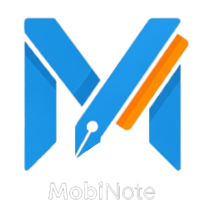
</p>

# MobiNote

A modern, accessible note-taking app with advanced formatting and multimedia support.

## Table of Contents

- [Installation](#installation)
- [Main Screen Overview](#main-screen-overview)
- [Themes](#themes)
- [Notebooks and Notes](#notebooks-and-notes)
- [Editing Notes](#editing-notes)
- [Text Formatting](#text-formatting)
- [Widgets: Images and Lists](#widgets-images-and-lists)
- [Counters in Lists](#counters-in-lists)
- [Additional Information](#additional-information)


# Installation

1. **Clone the repository**
   ```bash
   git clone <repository_url>
   cd <repository_name>
   ```

2. **Install dependencies**
   ```bash
   flutter pub get
   ```

3. **Run the application**
   - On an emulator or connected device:
     ```bash
     flutter run
     ```
   - Or build an APK:
     ```bash
     flutter build apk
     ```

4. **Requirements**
   - Flutter SDK (https://flutter.dev)
   - Android Studio or VS Code (recommended)
   - Android device or emulator


# Main Screen Overview

When you launch MobiNote, you are greeted with the main screen, which displays your recent notes and notebooks.  
You can quickly create a new note using the round pencil button in the bottom right corner.

The top bar provides access to additional options:
- **Theme selection**
- **Database reset** (deletes all notes)

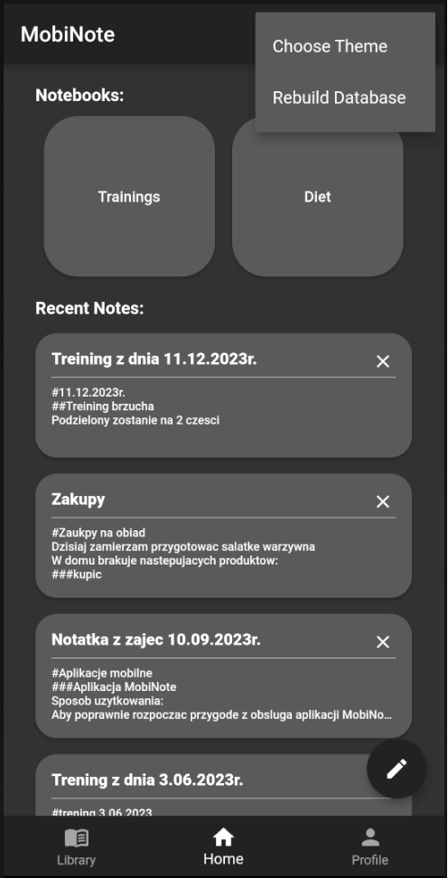

# Themes

MobiNote supports three visual themes for accessibility and comfort:

- **Dark**: For low-light environments
- **Light**: For bright environments
- **Easy**: High-contrast, larger fonts and icons for better readability

Switch themes from the top bar menu.

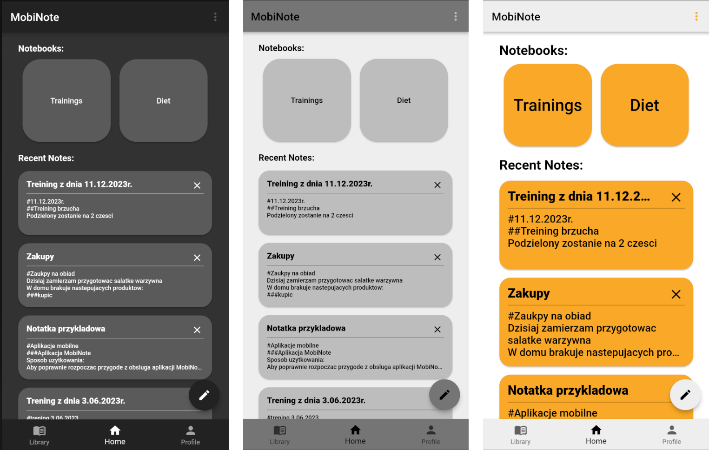
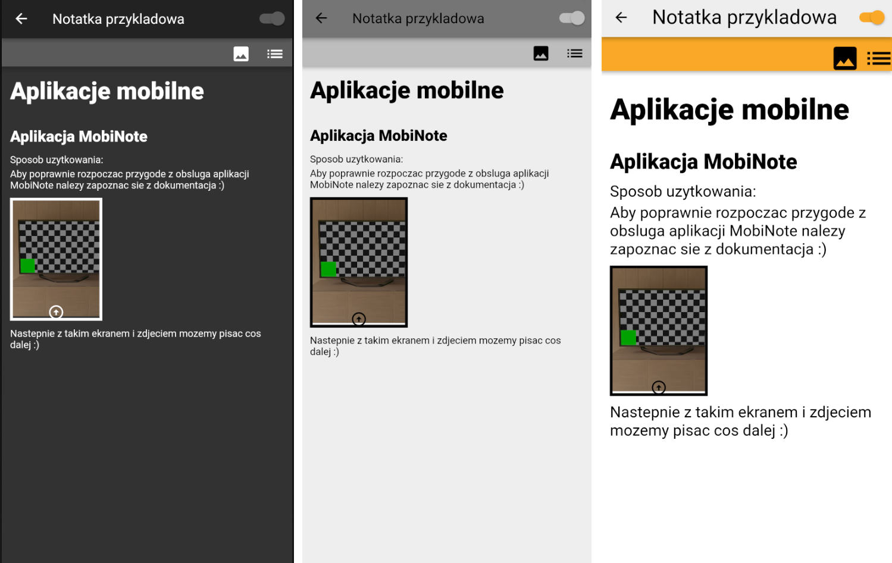


# Notebooks and Notes

- **Notebooks**: Organize your notes into notebooks (feature in development).
- **Recent Notes**: See a list of your latest notes, each showing the title and a preview of the content.

You can delete a note using the "X" button or tap a note to view and edit it.

# Editing Notes

When you create or open a note, you enter the editing screen:

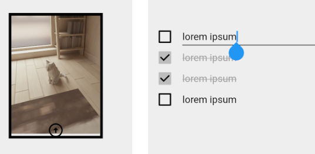

- **Top bar**:  
  - Back/Save button (saves changes and returns to main screen)
  - Title field
  - Save option switch (choose whether to save changes)
- **Toolbar**:  
  - Add image
  - Add list

All changes are reflected in real time in the editor area.

# Text Formatting

MobiNote supports Markdown-inspired formatting:

- **Headings**:  
  - `#` Heading 1  
  - `##` Heading 2  
  - `###` Heading 3  
  - `####` Heading 4

- **Text styles**:  
  - `*text*` for **bold**
  - `^text^` for *italic*
  - `_text_` for <u>underline</u>
  - `~text~` for ~~strikethrough~~

Styles can be nested, but not overlapped.

**Example of nested styles and raw text with style markers:**

<p>
   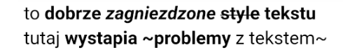
   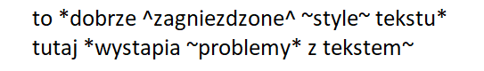
</p>


Application shows style symbols when you enter styled text:

<p>
   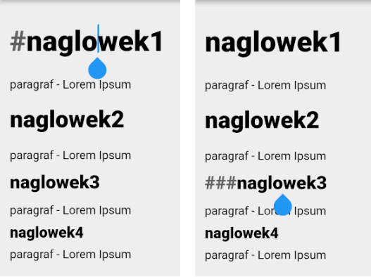
   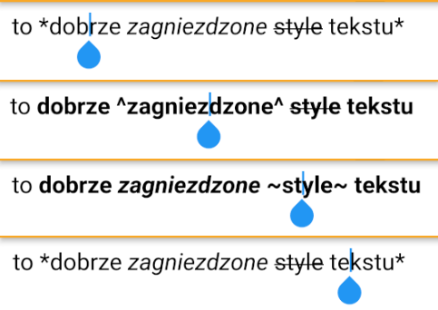
</p>

# Widgets: Images and Lists

## Images

You can insert images into your notes from your device.  
Resize or delete images directly in the editor.

- **Edit mode**: Tap the image to resize it using the handle.
  
- **Selection mode**: Long-press the image to reveal options to delete or change the image.

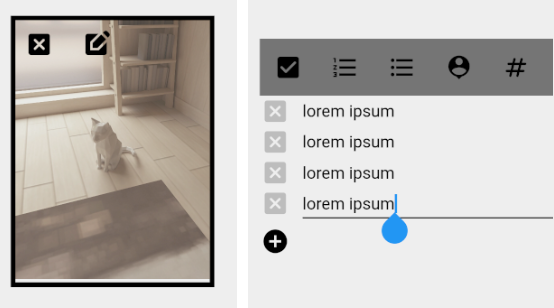

## Lists

Add interactive lists to your notes.  
Supported list types:
- Checkbox
- Numbered
- Symbol-marked
- Counter

Add or remove rows using the enter key or the "+" and "x" buttons.

## Counters in Lists

The counter list type lets you track progress towards a goal.  
Tap the counter to increment it; tap the goal number to edit the target.

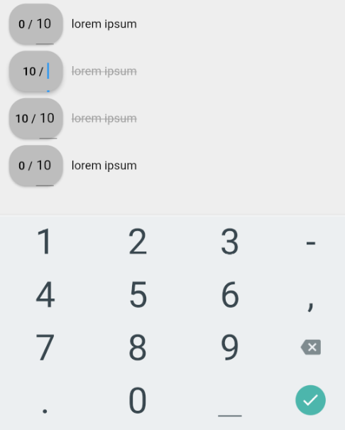

# Additional Information

- Notes are made up of text paragraphs and widgets (images, lists).
- Editing and deleting paragraphs is intuitive via keyboard and gestures.
- The "easy" theme is designed for users who need higher contrast and larger UI elements.
- New notes are only saved if you make changes and use the back button in the top bar.

---

**Enjoy using MobiNote!**

If you have any questions or suggestions, feel free to open an issue or contribute to the project.

---

## Prepare Environment

My current environtment preparing:

- Install according to the [official website](https://docs.flutter.dev/get-started/install):
    - Flutter 
    - Android Studio
    - Android Emulator
- [Prepare Visual Studio Code](https://docs.flutter.dev/get-started/editor?tab=vscode)

## Running

Current way to run an application:
- clone this repo
- run Android Emulator (for me this is `Pixel 6 API 30`)
    to run an emulator from Windows terminal:
    you can run a new Windows Terminal and go to the sdk directory
    for me it was `C:\Users\<my_user>\AppData\Local\Android\Sdk\emulator`
    and run `emulator.exe -avd <avd_name>`
    to see available avds run `emulator.exe -list-avds`
    example:
    ```
    C:\Users\bartq\AppData\Local\Android\Sdk\emulator> .\emulator.exe -list-avds
    Pixel_6_API_30
    C:\Users\bartq\AppData\Local\Android\Sdk\emulator> .\emulator.exe -avd Pixel_6_API_30
    ```
- flutter run

## Getting Started

This project is a starting point for a Flutter application.

A few resources to get you started if this is your first Flutter project:

- [Lab: Write your first Flutter app](https://docs.flutter.dev/get-started/codelab)
- [Cookbook: Useful Flutter samples](https://docs.flutter.dev/cookbook)

For help getting started with Flutter development, view the
[online documentation](https://docs.flutter.dev/), which offers tutorials,
samples, guidance on mobile development, and a full API reference.
