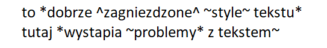
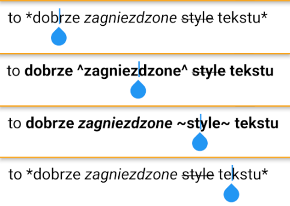
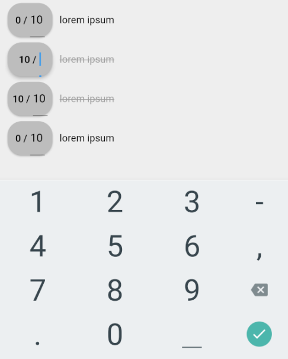
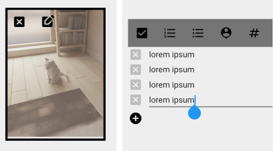
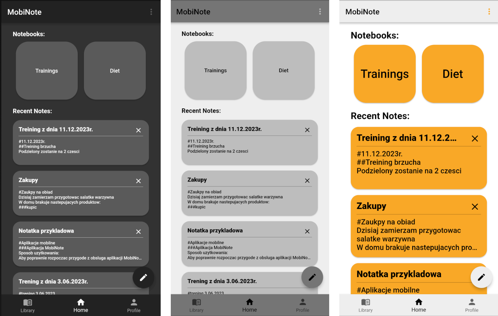

<p align="center">
   
</p>

# MobiNote

**A native Android application for seamless, interactive note-taking.**

> **Project Context:** Developed as a thesis project to explore advanced text rendering engines on mobile devices.

## Engineering Case Study

I approached this project with a focus on strict memory management, data structure efficiency, and algorithmic solutions rather than relying solely on high-level packages.

The core of this project is a **custom-built rendering engine** designed to solve complex problems inherent to rich text editing.

### 1. Solving the "Cursor Synchronization" Problem
**The Challenge:**
Standard rich text editors struggle when the **Logical Text** (saved string) differs from the **Visual Text** (rendered glyphs).
*   Example: A user types `*bold*` (6 chars). The editor renders **bold** (4 chars).
*   If the text length changes during rendering, the cursor index becomes desynchronized, causing it to "jump" unpredictably or select the wrong characters during editing.

**The Solution: Unicode Tokenization Engine**\
I implemented a custom parser that maps Markdown syntax to the **Unicode Private Use Area (PUA)**.
*   **Collision-Free Parsing:** By mapping syntax characters (e.g., `*`) to specific PUA characters (e.g., `\ue000`), the parser preserves the exact string length logically while altering the visual presentation.
*   **Result:** This ensures **O(1)** cursor alignment and solves the "Ambiguity Problem"—the parser instantly distinguishes between typing a math equation (`2 * 2`) and a bold syntax marker (`*text*`).

### 2. Non-Destructive Real-Time Rendering
**The Challenge:**
Modifying the `TextEditingController` directly to hide markdown characters causes **Data Loss** (the app "forgets" which text was originally formatted) and **Infinite Build Loops** (modifying state during the render phase).

**The Solution:**
I implemented a pipeline where the **Model** (Raw Markdown) is strictly separated from the **View** (TextSpans).
*   The `buildTextSpan` method parses the raw text into a hierarchical **Abstract Syntax Tree (SpanInfo)** on the fly.
*   This structure is converted to Flutter `TextSpan` objects for rendering.
*   **Benefit:** The underlying data remains pure, editable markdown, while the user sees rich text.

### 3. Architecture & Design Patterns
*   **Abstract Factory Pattern:** Used in `NoteEditorWidgetFactory` to inject complex, interactive Flutter widgets (images, counters) directly into the text stream based on serialized JSON data.
*   **Lazy Loading:** The note list utilizes `ListView.builder` to render elements only when visible, optimizing memory usage for notes containing high-resolution media.
*   **State Management:** Utilizes **GetX** for lightweight Dependency Injection and reactive state management.

---

## User Manual & Features

MobiNote eliminates the distinction between "Edit Mode" and "View Mode." Formatting is applied live, and syntax is revealed dynamically when you tap into a word to edit it.

### 1. Live Text Formatting
Formatting is applied automatically as you type. To edit a style, simply tap into the styled word to reveal the syntax markers.

| Style | Syntax | Example |
| :--- | :--- | :--- |
| **Headers** | `#` to `####` | `# Title` |
| **Bold** | `*text*` | `*Important*` |
| **Italic** | `^text^` | `^Emphasis^` |
| **Underline** | `_text_` | `_Underline_` |
| **Strike** | `~text~` | `~Done~` |

&nbsp;


<p>
   
   <br>
   <em>Raw text logic.</em>
</p>

<p>
   
   <br>
   <em>Real-time rendering with revealed syntax.</em>
</p>

&nbsp;

### 2. Interactive Widgets
MobiNote treats widgets as first-class citizens within the text flow.

*   **Counters:** A specialized widget for tracking repetitions (e.g., gym sets). Tap left to increment, tap right to set the goal.
*   **Smart Lists:** Checkboxes and numbered lists that preserve indentation.
*   **Images:** Insert from gallery. Tap to **Resize** (Edit Mode) or long-press to **Replace/Delete** (Selection Mode).

<p align="center">
   
   
</p>

### 3. Themes
The application supports **Dark**, **Light**, and **Easy** (High Contrast/Large Text) themes for accessibility.

<p align="center">
   
</p>

---

## Technology Stack

*   **Language:** Dart
*   **Framework:** Flutter
*   **Database:** SQLite (via `sqlite3` and `drift`)
*   **Architecture:** MVC / Service-based modularization

## Installation

1.  **Clone the repository**
    ```bash
    git clone https://github.com/bsobocki/MobiNote.git
    ```
2.  **Install dependencies**
    ```bash
    flutter pub get
    ```
3.  **Run the application**
    ```bash
    flutter run
    ```

---


**Author:** Bartosz Sobocki
